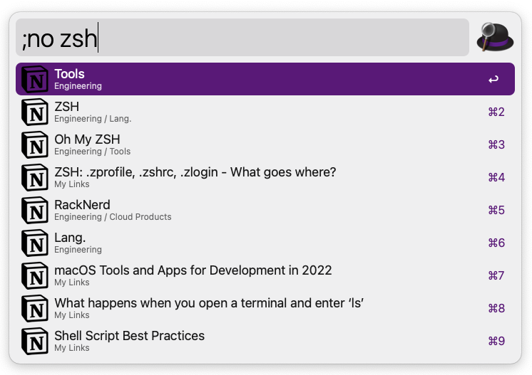
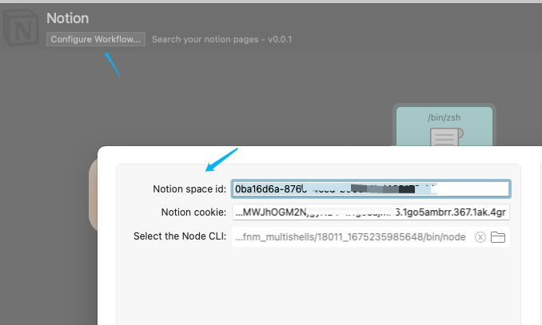

# Alfred Notion Workflow

Use this workflow to search your notion pages.

Click [here](https://github.com/Youmoo/alfred-notion-workflow/releases) to download the latest release.

## Configuration

| Name            | Example Value                | Description                                                                                                                    |
|-----------------|------------------------------|--------------------------------------------------------------------------------------------------------------------------------|
| NODE_CLI        | /usr/local/bin/node          | The path of the node binary. You can get it by running `which node` from the terminal                                          |
| NOTION_COOKIE   | notion_browser_id=83305....  | Your cookie value. You can get it by logging into [notion.so](https://notion.so) and inspecting your browser's network request |
| NOTION_SPACE_ID | 0ba16d6a-87...               | Your workspace id. You can get it the same way you get notion cookie                                                           |

### Configuration Example

## Actions

From the search result:

- Press `Enter` to open the page in your default browser
- Press `CMD + Enter` to open the page in your Notion app
- Press `CMD + C` to copy the link of the page
- Press `CMD + L` to display the current data (for debugging purpose)
